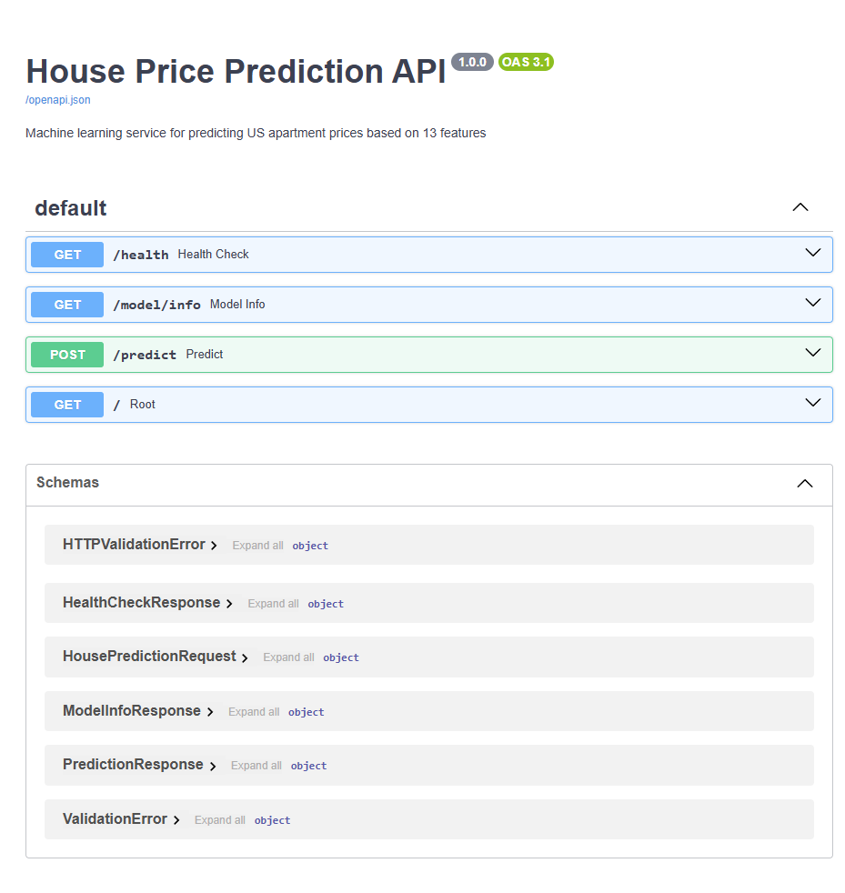

# House Price Prediction API

Production-style FastAPI service that predicts apartment prices from 13 property features using a trained machine learning model.

## Why This Project
- Demonstrates API design with FastAPI and Pydantic validation
- Serves an ML model behind clean REST endpoints
- Includes health and model-metadata endpoints for operational visibility

## Tech Stack
- Python
- FastAPI
- Pydantic
- NumPy
- Joblib
- Uvicorn

## Project Structure
- `main.py` - FastAPI app and HTTP endpoints
- `api.py` - model loading, prediction logic, and service health helpers
- `schemas.py` - request/response validation models
- `model.pkl` - trained regression model artifact
- `model_metadata.json` - model information and expected feature order

## Quick Start
### 1) Create and activate virtual environment (PowerShell)
```powershell
python -m venv venv
.\venv\Scripts\Activate.ps1
```

### 2) Install dependencies
```powershell
pip install -r requirements.txt
```

### 3) Run the API
```powershell
uvicorn main:app --reload
```

### 4) Open docs
- Swagger UI: http://127.0.0.1:8000/docs
- ReDoc: http://127.0.0.1:8000/redoc

## API Endpoints
- `GET /` - API overview
- `GET /health` - service health + model/metadata load status
- `GET /model/info` - model metadata (type, version, features, RMSE)
- `POST /predict` - predict price from feature input

## API Demo (curl)
Run the server first:

```powershell
uvicorn main:app --reload
```

Then call the prediction endpoint:

```powershell
curl -X POST "http://127.0.0.1:8000/predict" ^
  -H "Content-Type: application/json" ^
  -d "{\"total_images\":10,\"beds\":3,\"baths\":2.5,\"area\":1800.0,\"latitude\":40.7128,\"longitude\":-74.006,\"garden\":1,\"garage\":1,\"new_construction\":0,\"pool\":0,\"terrace\":1,\"air_conditioning\":1,\"parking\":1}"
```

Example response:

```json
{
  "predicted_price": 358764.22,
  "currency": "USD",
  "model_version": "1.0.0"
}
```

## Swagger Docs Screenshot



## Example Prediction Request
```json
{
  "total_images": 10,
  "beds": 3,
  "baths": 2.5,
  "area": 1800.0,
  "latitude": 40.7128,
  "longitude": -74.006,
  "garden": 1,
  "garage": 1,
  "new_construction": 0,
  "pool": 0,
  "terrace": 1,
  "air_conditioning": 1,
  "parking": 1
}
```

## Notes
- The prediction pipeline uses the exact feature order defined in `model_metadata.json`.
- Model and metadata are loaded at application startup for efficient inference.

## Recruiter Highlights
- Clean API boundaries: routing, business logic, and schema validation are separated.
- Operational health endpoint suitable for deployment checks.
- Reproducible local setup with dependency pinning.
